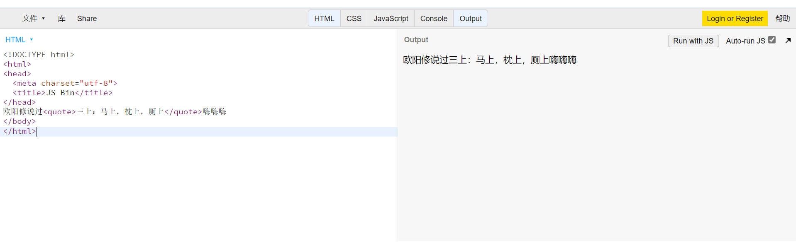

# 《HTML入门笔记1》
近期学习了有关HTML的一些基础知识，并做了一些笔记，以下就是笔记的主体内容，内容包含五个部分，分别为：
1. HTML是谁发明的？
2. HTML的起手式应该写什么？
3. 常用的表章节标签有哪些，分别是什么意思？
4. 全局属性有哪些？
5. 常用的内容标签有哪些，分别是什么意思？
  
  本文是自己观看饥人谷方应杭老师的《前端体系课》中的所学知识内容，由于本人是初学者，其中的内容可能表达或描述不够准确与全面，望各位能够多多谅解，另外，若有错误的内容，也恳请各位大佬们批评指正，感谢各位。
## HTML是谁发明的？
HTML的发明者是来自英国的Tim Berners-Lee，此人被称为HTML之父，由于2004年英国女皇给他颁发不列颠帝国勋章的爵级司令勋章，之后的叙述中将用**李爵士**来代替。  
那么李爵士干了什么事呢？  
在上世纪80年代，李爵士在物理实验室工作时，闻到走廊旁紫丁香花丛的香气，于是就有了一个灵感：人脑可以透过互相联贯的神经传递信息，为什么不可以经由电脑文件互相连接形成"超文本"呢？  
于是在1989年，李爵士就成功开发出了世界上第一个Web服务器和Web客户机，同年12月，李爵士为他的发明定名为World Wide Web，即我们熟悉的**WWW**。  
而WWW就是URL、HTTP、HTML的集合，使用HTML，将所需要表达的信息按某种规则写成HTML文件，通过专用的浏览器来识别，并将这些HTML文件“翻译”成可以识别的信息，即我们所见到的网页。
## HTML的起手式应该写什么？
认真的说，需要写这些
```HTML
<!DOCTYPE html>
<html lang="en">
<head>
    <meta charset="UTF-8">
    <meta http-equiv="X-UA-Compatible" content="IE=edge">
    <meta name="viewport" content="width=device-width, initial-scale=1.0">
    <title>Document</title>
</head>
<body>
    
</body>
</html>
```
是不是很多东西，但是只要你有安装*emmet插件*，就只需要在编译器中输入一个！，然后加一下tab就可以自动帮你输入这一段HTML起手式。（非常好用！）  
输入效果如下图所示  

## HTML常用的表章节的标签有哪些，分别是什么意思？
常用的表章节标签有：  
* h1~h6
* section
* article
* main
* aside  
他们的含义及用法是：  
## h1~h6
h1~h6标签为标题标签，展现了6个不同级别的标题，不同标题的字体大小不同，h1的字体最大，h6级别的字体最小。下面放图来感受一下
  
*图中少了一个`<body>`,忘记写了。。。*
## section
section表示一个通用独立章节，一般来说会在section中包含一个标题，即h1~h6一般为section的子元素。
```html
<body>
    <section>
        <h1>我是老八</h1>
        <p>嗨害嗨</p>
    </section>
</body>
```
## article
意思为文章，是HTML中的一个独立结构，其意在可成为独立分配或者可复用的结构，一般来说一个article结构中会有若干个section结构。  
```html
<body>
    <main>
      <article>
        <header>我是谁？</header>
        <h1>大家来说说我是谁？</h1>
        <section>
          <h2>我是老六</h2>
          <p>人人都是老六</p>
        </section>
        <section>
          <h2>我是老八</h2>
          <p>嗨害嗨</p>
        </section>
        <footer>奥利给</footer>
      </article>
    </main>
  </body>
```
article与section元素的区别：  
article是页面中独立的、完整的内容，除了内容部分一般还有自己的标题、头注和脚注。  
section是对页面的内容进行分块，一个section通常由内容和标题组成。  
**什么时候该用article？什么时候用section呢？**  
article注重独立性，section强调分块，通常来说，一块内容相对独立与完整的时候则推荐用article，但是如果需要把一块内容分成好几块的时候则推荐使用section。
## main
此元素呈现了HTML文档的主体部分，一般是article的父元素。
```html
<body>
    <main>
    <article>
      <section>
        <h2>我是老六</h2>
        <p>人人都是老六</p>
      </section>
      <section>
        <h2>我是老八</h2>
        <p>嗨害嗨</p>
      </section>
    </article>
    </main>
  </body>
```
## aside
与main元素相反，是表示与主体内容无关的部分，可被单独拆分出来而不会使整体受到影响。通常表现为侧边栏或者标注框。
```html
<section>
  <h2>我是老八</h2>
    <aside>老八：一个神奇的物种</aside>
  <p>嗨害嗨</p>
</section>
```
## 全局属性有哪些？
全局属性指所有标签都具备的属性。  
常见的全局属性有：  
* class
* contenteditable
* hidden
* id
* style
* tabindex
* title  
## class
表示声明，创建一个标签，用于定义该标签中的属性。

图中我用class声明了两个标签middle和bordered，并使用.middle和.bordered来定义两个标签的样式。*（推荐使用加上标签的形式来定义标签，这样可以使每个标签独立出来，若下面的class中包含多个独立标签，就可以直接使用，而不需要再次定义一个全新的标签样式）*  
*图里background打错了，所以背景才没有颜色，一开始还没发现，下面写style的时候才发现打错了。。。*
## contenteditable
该元素表示是否可以被用户编辑，用法如下所示：

只要在标签后面添加contenteditable="true"就表示可以被编辑了。*（注意：true表示可被编辑，false表示不可被编辑，注意true不要拼错了，刚刚试了好久发现没反应才发现是true拼错了。。。）*
## hidden
使标签元素快速消失，效果如下：

## id
id是定义了一个全文档唯一的标识符*(在MDN上的解释)*，该属性的作用与class类似，也可以定义标签中的属性，但是实际上，id可以存在很多个，而且多个id并不会报错，因此不能保证它的唯一性，所以不到万不得已，不要使用id属性。
## style
该元素包含文档的样式信息或者文档的部分内容。，一般和class属性搭配使用。

## tabindex
tabindex表示该元素是否可以被聚焦，通俗点说就是当你没有鼠标的时候，用tab来访问元素是否可以访问得到。  
用法就是在标签后面加上`tabindex="一个数字"`,例如`<h1 tabindex="1">请用tab进行访问</h1>`，这里有一些讲究，填写的数字中有两个特殊值，一个是0，一个是-1，填写0的时候代表该标签会是最后一个访问到的，而-1表示，永远不会访问该标签。  
此外，如果是正数，tab将会按数字从小到大依次访问，数字可以不用按顺序来，比如100，150，200，访问顺序就会从100开始，然后150，最后访问200。
## title
这个表示标题，一般在head标签中，HTML起手式就会自动创建一个title标签，该标签就是为浏览器的页面标题，效果图如下：  
```html
<!DOCTYPE html>
<html>
<head>
  <meta charset="utf-8">
  <title>页面标题</title>
</head>
<body>
  <h1>标题</h1>
</body>
</html>
```

## 常用的内容标签有哪些
常用的内容标签有：
* ol+li
* ul+li
* dl+dt+dd
* pre
* hr
* br
* a
* em
* strong
* code
* quote
* blockquote  
## ol+li & ul+li
ol+li是有序列表，ul+li是无序列表，很好理解，放张图就明白了。

## dl+dt+dd
指描述列表，用于描述一个东西。放张图就懂了  

## pre
用于保留原格式，包括空格和回车。

## hr & br
hr是在图中加一条水平分割线，直接输入`<hr>`即可。
br是指分隔符，用于强行换行使用，直接输入`<br>`即可。

## a
代表超链接，也叫做锚元素，可以通过它的 href 属性创建通向其他网页、文件、同一页面内的位置、电子邮件地址或任何其他 URL 的超链接。
语法为：`<a href="网址">（点击的内容）</a>`  

*注意：输入的网址前面要加上**http：//**，不然不会导航到其他网址*  
另外，可以在网址后面添加` target="_blank"`即可设置点开后的页面是在一个新的标签页，而不是覆盖当前的网页。
## em & strong
em表示斜体强调，strong表示加粗强调。直接放效果图：

## code
表示代码行，效果图如下：

## quote & blockquote
quote是引用的意思，blockquote即为块级引用
quote的引用可以前后连接在一起：用方应杭老师的例子：

而使用blockquote则会变成：

**大致内容就是以上这些了，正如开篇所讲的，里面的内容可能有些片面，但的确是我这一段时间的所学所得，若是文章中有错误也恳请各位批评指正，谢谢。**